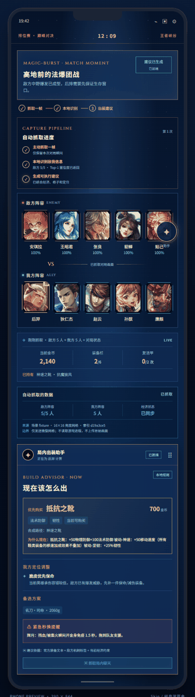

# 局内出装助手（Local Build Agent）

一个面向《王者荣耀》玩家的、本地优先的动态出装决策 Agent。

它不替玩家操作游戏。玩家在选人或商店阶段主动触发截图，Android 悬浮球截取**一帧**并立刻停止共享；
画面先在手机本地降采样为 16×16 亮度网格，识别敌方 5 名英雄（返回 Top-3 候选 + 置信度），
由玩家**确认或纠错**后，才调用本机 FastAPI 规则引擎，返回带证据的出装建议。

> **案例研究**：[`docs/CASE_STUDY.md`](docs/CASE_STUDY.md) — 问题、工作流、AI 边界与评测。 **产品文档**：[`docs/MOBA_BUILD_AGENT_PRD.md`](docs/MOBA_BUILD_AGENT_PRD.md)

> **运行成本：免费** — 全程本地运行，零 API key、零付费调用；数据来自官方公开静态资源，识别与决策都在本机完成，在线 Demo 走免费 GitHub Pages。

### 🕹️ 在线体验（GitHub Pages · 免安装）

**[点这里直接打开 H5 演示](https://olivia-happy.github.io/moba-build-agent/)** — 后端不可用时自动回退到内置快照，任何人、任何设备打开即用，无需运行代码。

**30 秒看懂它**（跟着点一遍即可）：

1. 打开即自动跑「高地前法爆团战」→ 看到系统识别敌方 5 人、生成带证据的出装建议（优先抵抗之靴 + 法防）。
2. 底部点「紧急秒换提醒」区域 → 关键团前给出保命装秒换方案，不是一句"注意走位"。
3. 顶部切换到「河道遭遇战 / 龙坑拉扯」→ 建议随敌方阵容**实时变化**。
4. 点我方可切换的英雄 → 定位不同，推荐跟着调整——这是完整产品闭环。

### 界面预览


_本地规则引擎 + 官方装备知识库，返回带证据的出装建议与紧急秒换提醒。_



_自动演示：切换三个对局场景，出装建议随敌方阵容实时变化。_

## 产品边界

- 不读取游戏内存，不自动点击，不自动购买，不提供规避反作弊的能力。
- 不调用官方战绩接口，不需要任何 API key，全程本地运行。
- Android 仅在玩家主动点击“识别当前画面”后请求系统截图授权；截取一帧后立即停止共享。
- 建议附装备机制证据、规则版本、识别索引哈希和未知项提示，不伪装成唯一最优解。

## 核心闭环（已实现）

```text
玩家点悬浮球 → 系统截图授权 → 截取 1 帧(.lum) → 本地裁剪 5 个头像 → 16x16 亮度网格匹配
→ Top-3 候选 + 置信度展示 → 玩家确认 / 点选纠正 / 手动输入 ID → 调本机 FastAPI
→ 阵容威胁聚合 → 装备功能缺口 → 金币/格子/鞋类唯一组/复活甲次数约束 → 带证据建议
```

## 新增能力（本轮）

- **装备知识库**：接入官方 item.json（121 件装备，含来源 URL 与内容哈希校验），提供目录与单件查询，每条装备带价格、功能标签、唯一组、复活甲每局限次、主动冷却等元数据。
- **紧急秒换建议**：POST /api/decisions 新增 emergency_swap 段，覆盖辉月(金身)/贤者的庇护(复活甲)/名刀·司命/血魔之怒/纯净苍穹与冷静之靴→抵抗之靴，受金币、格子、鞋类唯一组与复活甲 2 次/局约束。
- **英雄威胁画像**：接入官方 herolist.json（132 英雄），威胁标签集中在 hero_profiles.py 可维护；未知英雄仍明确披露，不猜测。
- **Android 端增强**：ReviewScreen 支持输入已持有装备与复活甲次数；决策页展示装备价格、功能解释、组件路径与秒换提醒；13 个 Android 单元测试通过，APK 已重新构建。

## 架构

| 模块 | 职责 | 状态 |
| --- | --- | --- |
| android-app/ | Android 悬浮球、主动单帧截图、.lum 灰度帧、本地头像指纹匹配、确认/纠错 UI、调用本机 API | 13 个 Android 单元测试通过，APK 已构建成功 |
| backend/ | FastAPI：装备知识库、阵容威胁分析、装备功能推荐、紧急秒换、购买计划（组件/替换/存钱）、证据返回 | 42 个测试通过，E2E 已实测 |
| data/portrait_index.json | 132 英雄头像指纹索引（16×16 亮度网格 + 内容哈希），可复现构建 | 已生成并同步到 Android assets |
| data/item_catalog_raw.json | 官方装备目录快照（来源 URL、获取时间、内容哈希） | 已抓取保存 |
| data/hero_catalog_raw.json | 官方英雄目录快照（来源 URL、获取时间） | 已抓取保存 |
| backend/scripts/ | build_portrait_index.py、sync_portrait_index_to_android.py | 可用 |

## 启动后端

```powershell
cd backend
..\.venv\Scripts\python.exe -m uvicorn app.main:app --reload --port 8000
```

然后访问 http://127.0.0.1:8000/docs 。

### 接口速览

- GET /health：健康检查（ai_mode: offline）。
- GET /api/catalog/items：官方装备目录（价格、功能标签、组件、限制、来源）。
- GET /api/catalog/items/{item_id}：单件装备规则。
- GET /api/catalog/portrait-index：当前头像索引元信息（版本、英雄数、内容哈希）。
- POST /api/frames/analyze：仅接受 input_source=player_tapped_capture + layout_version=draft-layout-1080x2400-v1；传入 5 个槽位的 16×16 亮度网格，返回每个槽位 Top-3 候选与索引哈希。
- POST /api/decisions：仅接受 input_source=player_confirmed_screen；返回优先级需求、威胁统计、未识别英雄、带证据的出装建议与紧急秒换建议。

## 验证

```powershell
cd backend
..\.venv\Scripts\python.exe -m pytest -q   # 42 passed
```

```powershell
cd android-app
.\gradlew.bat testDebugUnitTest           # Android 单元测试
.\gradlew.bat assembleDebug               # 构建 app-debug.apk
```

## Android 构建前置条件

- JDK 17+、Android SDK（API 37）、Gradle 9.x（或 Android Studio）。
- 本机已配置：JDK 21 (Temurin)、Android SDK 37、Gradle 9.7 wrapper。

## Android ↔ 本地后端联调

- 模拟器：10.0.2.2:8000 指向宿主机 FastAPI。
- 真机：需要玩家在 LocalDecisionClient.kt 中配置电脑的局域网地址，且手机与电脑处于同一可信网络。
- 当前 HTTP 仅用于本地开发；对外部署必须改为 HTTPS 且不能把玩家画面发给未知服务。

## 数据来源与隐私

- 英雄列表与头像来自王者荣耀公开静态资源（pvp.qq.com heroList + 官方 CDN 头像），由 build_portrait_index.py 可复现构建；索引带来源 URL、获取时间与内容哈希。
- 装备目录来自 https://pvp.qq.com/web201605/js/item.json ，保存为 data/item_catalog_raw.json 并做内容哈希校验。
- 英雄目录来自 https://pvp.qq.com/web201605/js/herolist.json ，保存为 data/hero_catalog_raw.json 。
- 玩家主动截取的画面在手机本地降采样为灰度 .lum 文件，仅 5 个 16×16 网格会上传到本机服务；原始帧不离开手机。
- 识别只是候选，玩家必须确认或纠错；低置信度提示重试或手选英雄。
- 出装建议基于版本化装备规则（组件价格、鞋类唯一组、复活甲次数等）和英雄机制标签，每条建议附证据。

## 面试叙事要点

1. **用户与痛点**：大量玩家只跟着系统推荐出装，不知道每个装备功能，也不会根据敌方阵容临时调整。
2. **为什么需要识别（AI/视觉）**：选人界面没有官方可读取的结构化数据，截图识别头像比让玩家手输 5 个英雄名更快、更不容易出错；识别结果必须人工确认，防止误判进入推荐。
3. **为什么需要统计/规则引擎**：把“敌方 5 人机制标签计数 → 优先需求排序 → 装备功能覆盖 → 金币与唯一组/次数约束”做成显式、可解释、可测试的规则，避免黑箱。
4. **紧急场景**：金身/复活甲/名刀/血魔/苍穹等保命装与冷静鞋→抵抗鞋，都需要在有限金币、格子、次数约束下给出可执行的秒换建议，而不是一句“注意走位”。
5. **可追溯**：每个建议带装备证据、威胁统计、索引哈希与规则版本；识别候选带置信度，玩家可纠错。
6. **工程闭环**：公开数据可复现构建、资产哈希校验、单帧截图即停、幂等/超时处理、42 个后端测试与 E2E 验证。
