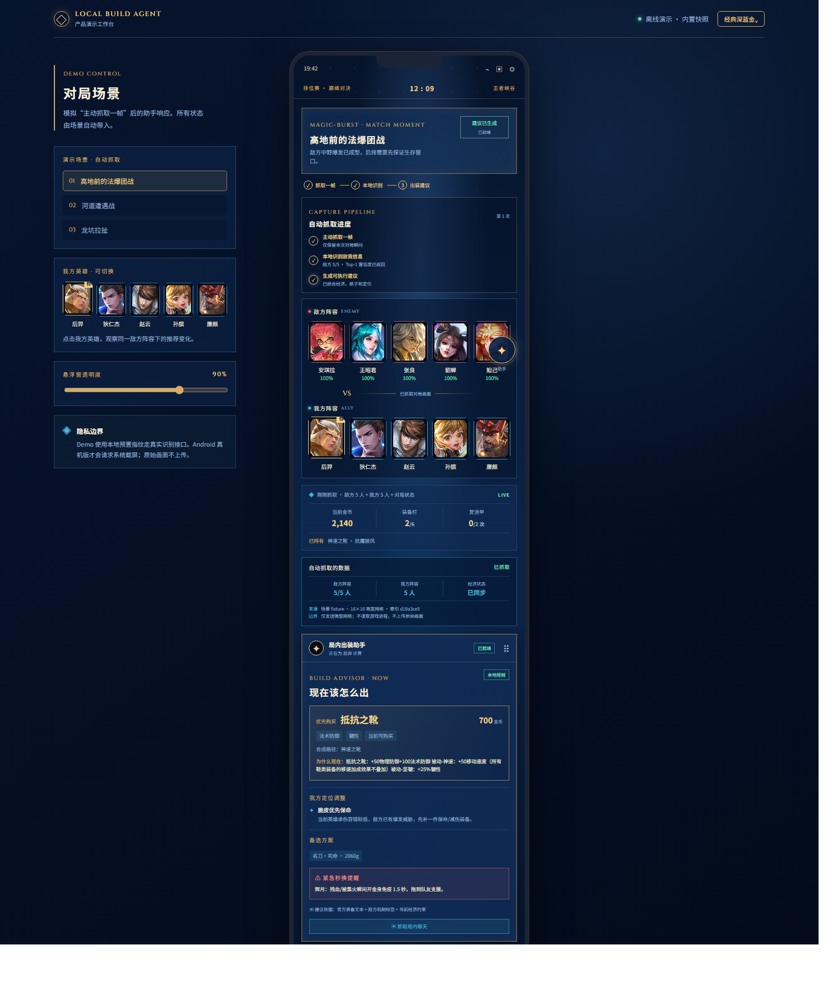

# MOBA Build Agent 案例研究：把"跟系统出装"变成"看懂这一局该怎么出"

> 演示录屏待补：此处将挂 1 分钟操作演示视频。

## 1. 问题与用户

《王者荣耀》玩家出装大多依赖两条路径，都有明显缺口：

- **只跟系统推荐出装**：不理解装备功能，逆风、被针对时不会调整，不知道"为什么这局要先出魔抗"。
- **看攻略 / 问朋友**：覆盖不到当前这一局的具体阵容与经济状态，时机滞后。

真正缺的不是"全网最强出装表"，而是**针对本局敌方阵容、在当前金币/格子/复活甲次数约束下、可执行的决策与理由**。

服务两类用户：

- **主流玩家（钻石及以下）**：需要"现在该买什么、为什么"，且要求解释清楚、不黑箱。
- **在意隐私与合规的玩家**：不想装云端分析工具，要求画面不出手机。

## 2. 为什么是"本地识别 + 规则引擎"，而不是云 AI

选人界面没有官方可读取的结构化数据。截图识别头像比让玩家手输 5 个英雄名更快、更不易错；但识别结果**必须由玩家确认**，防止误判进入推荐。

决策层刻意不用黑箱大模型，而用**显式、可解释、可测试的规则引擎**：

```text
敌方 5 人机制标签计数（越切/护盾/控制/法爆/物爆/回血…）
  → 优先需求排序（魔抗/韧性/物抗/减疗/生存…）
  → 装备功能覆盖（官方 121 件，组件路径/价格/唯一组/复活甲限次）
  → 经济约束（金币/格子/鞋类唯一组/复活甲 2 次/局）
  → 带证据的出装建议 + 紧急秒换方案
```

## 3. 核心闭环（当前已实现）

```text
玩家点悬浮球 → 系统截图授权 → 截取 1 帧(.lum，原始帧不上传)
  → 本地 16×16 亮度网格匹配 132 英雄官方头像指纹索引
  → Top-3 候选 + 置信度 → 玩家确认/纠错/手动输入
  → 调本机 FastAPI 规则引擎
  → 返回带证据的出装建议 + 紧急秒换（辉月/复活甲/名刀/血魔/苍穹、冷静鞋→抵抗鞋）
```

**关键设计**：识别结果必须人工确认后才进入决策。这一步同时解决"误识别进错推荐"和"隐私红线"两个问题——产品不读取游戏内存、不自动点击、不自动购买。

### 界面预览



### 关键能力

- **识别**：Android 悬浮球主动截一帧即停，本地头像指纹匹配，返回 Top-3 + 置信度。
- **决策**：阵容威胁聚合 → 需求排序 → 装备覆盖，每条建议带 `evidence`、价格、组件路径、`why_now`。
- **紧急秒换**：被切/要打关键团时，在金币、格子、鞋类唯一组与复活甲 2 次约束下给可执行方案。
- **可追溯**：装备知识库接入官方 item.json（121 件，含来源 URL 与内容哈希校验），英雄画像接入官方 herolist.json（132 英雄）。

## 4. AI 边界

| 环节 | 谁负责 | 为什么 |
| --- | --- | --- |
| 英雄识别 | 本地图像指纹 + 人工确认 | 选人界面无官方结构化数据；人必须兜底防误判 |
| 威胁→需求 | 显式规则引擎 | 可解释、可测试，拒绝黑箱 |
| 出装建议 | 规则 + 官方装备文本证据 | 每条可追溯到装备机制 |
| 紧急秒换 | 规则 + 金币/格子/次数约束 | 给可执行方案而非"注意走位" |
| 是否执行 | 玩家 | 产品不自动点击、不自动购买 |

**合规红线**：不读取游戏内存、不自动操作、不规避反作弊、不调用战绩接口、无需 API key、原始帧只留手机本地、识别需人工确认。

## 5. 工程与评测

- **后端**：FastAPI，42 项 pytest 全绿（装备目录、威胁聚合、紧急秒换约束、证据格式），全部本地确定性、零成本。
- **Android**：悬浮球 + 单帧截图 + 本地匹配 + 确认 UI，13 项单元测试，APK 构建通过。
- **E2E**：识别 → 确认 → 决策全链路实测。
- **H5 Demo（2026-09 新增）**：竖屏产品演示，内置三个对局场景；后端不可用时自动回退到**真实引擎生成的离线快照**，可静态部署，打开即用。

## 6. 业务假设、KPI 与合规前提

**业务假设**：多数玩家"不会根据敌方阵容调整出装"是真实高频痛点；把出装决策做成显式、带证据、本地可信的辅助，能提高装备理解与关键团战应对。

**候选 KPI**（需真实用户后才可度量，当前不构成结论）：

| 指标 | 业务含义 |
| --- | --- |
| 建议采纳率 | 玩家是否真的照建议出装 |
| 紧急秒换正确执行率 | 保命场景下建议是否被采用 |
| 识别纠错率 | 识别可靠性（越低越好） |
| 二次使用率 | 是否被持续在局内使用 |

**合规前提**：任何对局数据、战绩接口、自动操作功能都超出本产品边界；规模化前须与游戏厂商合规确认截图识别工具的运营许可。

## 7. 下一步

1. 真机截图坐标校准（当前为固定布局版本，需可视化拖框）。
2. 补"我方英雄 + 定位 + 经济阶段"维度（当前推荐主要被敌方威胁主导）。
3. 1 分钟操作录屏，挂到本案例页与作品集主页。

本案例是"统计+产品+全栈+本地 AI"的一次闭环实践：把真实玩家的模糊需求拆成可解释、可测试、有合规边界的决策产品。
